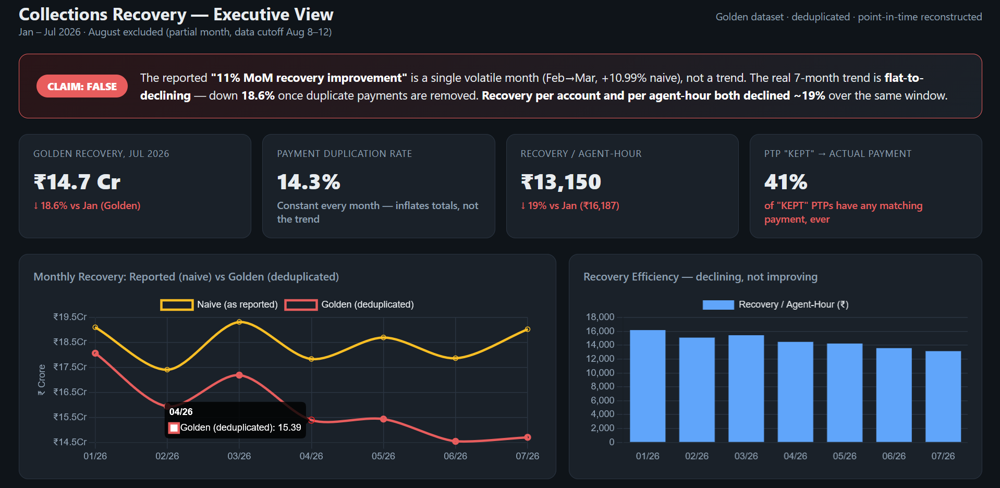
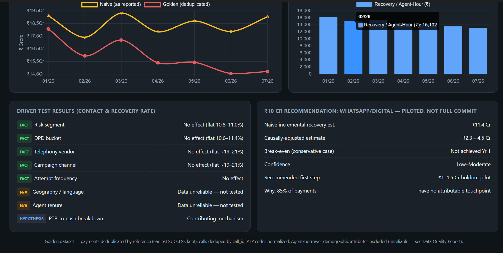

# CredResolve Collections Analytics — Data Analyst Assignment

## The headline answer

**The reported "recovery has improved by 11% month-on-month" is false as a trend claim.**
It matches one single volatile month (Feb→Mar 2026, naive MoM +10.99%) almost exactly, and
was reported as if it represented sustained performance. The real 7-month trend (Jan–Jul 2026;
August excluded as a truncated partial month) is **flat under the naive definition and declining
18.6% once duplicate payments are removed.** Recovery per account and per agent-hour both
declined ~19% over the same window — the most trustworthy signal in the dataset, since it's
built entirely from payments' own internal fields rather than a cross-table status label.

Full reasoning: [`docs/EXECUTIVE_MEMO.md`](docs/EXECUTIVE_MEMO.md) (2-page summary) and
[`notebooks/ANALYSIS_NOTEBOOK.ipynb`](notebooks/ANALYSIS_NOTEBOOK.ipynb) (full analysis with narration).


*One-screen view of the executive dashboard — open `dashboard/executive_dashboard.html` locally for the interactive version.*


*Key analytical outputs: naive vs. golden recovery, recovery per agent-hour, driver-test results, and the ₹10 Cr pilot recommendation.*

## Repo structure

```
docs/
  EXECUTIVE_MEMO.md            <- start here (2 pages, answers all 4 leadership questions)
  DATA_QUALITY_REPORT.md       <- every data issue found, how detected, how treated, impact
  ARCHITECTURE.md              <- production pipeline design (Raw -> Staging -> ... -> Dashboard)
  STATISTICAL_INVESTIGATION.md <- 7 bias/effect checks behind the -18.6% number (mix, cohort,
                                   selection, survivorship, Simpson's, attribution, time-series)
  COUNTERFACTUAL.md            <- DiD test of whether the mid-year targeting change caused the decline
  images/                      <- dashboard screenshots referenced above
  architecture_diagram.svg
notebooks/
  ANALYSIS_NOTEBOOK.ipynb      <- full reasoning + code, narrated
  01_profile.py .. 04_drivers.py    <- initial profiling, golden dataset build, metrics, driver analysis
  05_explore_strategy.py .. 05e_switch_timing.py  <- exploratory scripts behind the counterfactual
  06_statistical_investigation.py   <- runs all 7 tests in STATISTICAL_INVESTIGATION.md
  07_counterfactual_did.py          <- runs the DiD analysis in COUNTERFACTUAL.md
sql/
  01_golden_dataset.sql        <- reproducible cleaning logic as SQL views
  02_metrics.sql                <- all metric definitions + the headline 11%-check query
golden_dataset/
  *_golden.csv                  <- cleaned analytical tables
  cleaning_impact_log.csv       <- raw -> kept -> rejected row counts per cleaning step
data/
  *.csv, README.md              <- original source files as provided
dashboard/
  executive_dashboard.html      <- one-screen CEO view (open directly in a browser)
```

## Key findings

The most important thing to understand is that the 11% recovery improvement everyone's been
citing is a single-month artifact, not a trend — I check this explicitly in the SQL and memo.
Once you look at the full 7-month window and strip out duplicate payments, recovery is actually
down ~18.6%.

A few things surprised me while digging in:
- `agents.csv` and `borrowers.csv` turned out to be unreliable — descriptive fields (name, team,
  vendor, city) are statistically decoupled from the ID, so I excluded both from analysis rather
  than risk building conclusions on noise.
- There's no usable timezone signal anywhere — hour-of-day is flat across all 24 hours regardless
  of stated timezone, in both `calls` and `agent_sessions`.
- None of the usual operational levers (risk segment, DPD, vendor, channel, attempt frequency)
  show a meaningful effect on contact or recovery rate. That's a real negative result, not a gap
  in the analysis.
- Only 41% of accounts with a "KEPT" PTP status have any actual payment recorded against them —
  the label doesn't mean what it says.
- 85% of successful payments have no attributable touchpoint in any channel within 5 days, which
  is why I'm recommending the ₹10 Cr go in as a capped WhatsApp/Digital pilot (~₹1-1.5 Cr) rather
  than a full commit — channel ROI claims here are low-confidence by construction.

## How to reproduce

```bash
python3 notebooks/01_profile.py          # initial data profiling
python3 notebooks/02_golden_dataset.py   # builds golden_dataset/*.csv + cleaning_impact_log.csv
python3 notebooks/03_metrics.py          # rate-based metric definitions
python3 notebooks/04_drivers.py          # driver analysis across risk/DPD/vendor/channel/attempts
python3 notebooks/06_statistical_investigation.py  # runs the 7 bias/effect checks
python3 notebooks/07_counterfactual_did.py         # runs the DiD counterfactual test
```

Or open `notebooks/ANALYSIS_NOTEBOOK.ipynb` for the full narrated walkthrough.
For the SQL-native equivalent, run `sql/01_golden_dataset.sql` then `sql/02_metrics.sql`
against tables loaded into a `raw` schema.
